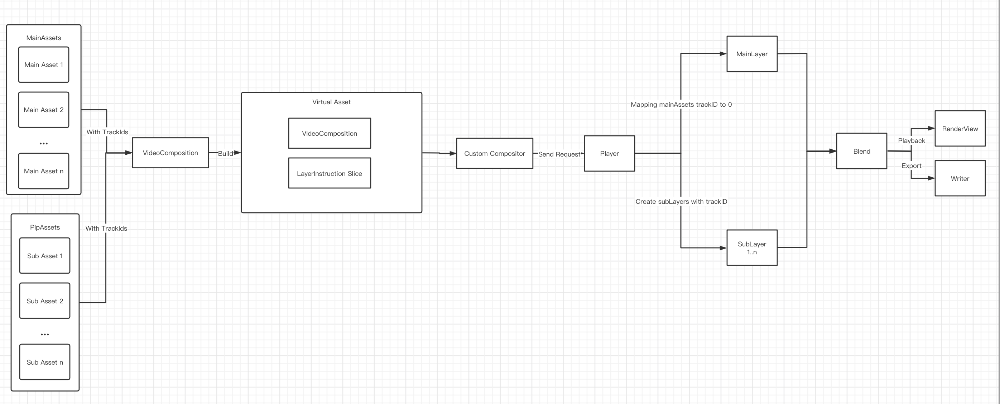
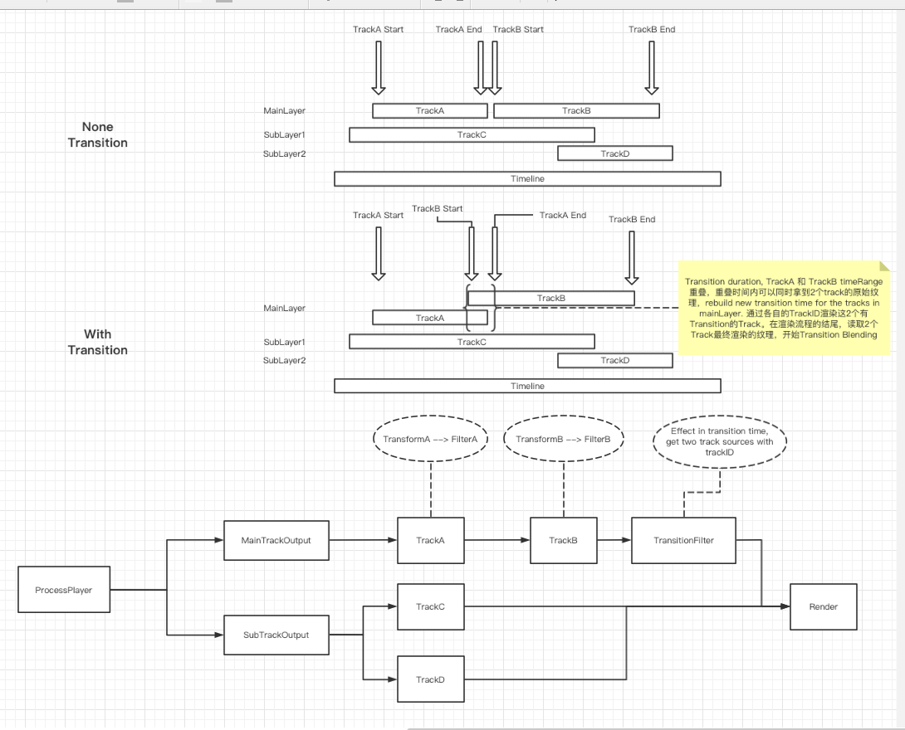

# MetalVideoProcess
MetalVideoProcess is a High-Performance video effects processing framework. It's base on GPUImage3  & Cabbage with AVFoundation, support asynchronous and multithread processing.

## Technical requirements

- Swift 5.0
- Xcode 10.2 or higher on Mac or iOS
- iOS: 11.0 or higher
- OSX: 10.11 or higher


## General architecture

MetalVideoProcess is built on  GPUImage3 & Cabbage. We extend the rendering pipeline in gpuimage3 to adapt the rendering output of one to many targets, so as to realize the rendering of multiple video clips.




Architecture design of video transition:





## Getting Started

Compile& import Framework

```swift
import MetalVideoProcess
```


## How to use

```swift
let asset1 = AVAsset(url: Bundle.main.url(forResource: "test", withExtension: "mp4")!)
let item1 = MetalVideoEditorItem(asset: asset1)

do {
	let editor = try MetalVideoEditor(videoItems: [item1])
	let playerItem = editor.buildPlayerItem()
	let player = try MetalVideoProcessPlayer(playerItem: playerItem)
            
	let beautyFilter1 = MetalVideoProcessBeautyFilter()
  player -- > beautyFilter1 --> renderView
	self.player = player
	self.player?.playerDelegate = self
          
} catch {
	debugPrint("init error")
}
```


## Sample

**SimpleFourSquareVideo**

iOS/Examples/SimpleFourSquareVideo 


**SimpleRealtimeFilterPlayback**

iOS/Examples/SimpleRealtimeFilterPlayback


**SimpleVideoExport**

iOS/Examples/SimpleVideoExport 


**SimpleVideoEditor** 

iOS/Examples/SimpleVideoEditor


**SimpleVideoTransition**

iOS/Examples/SimpleVideoTransition


